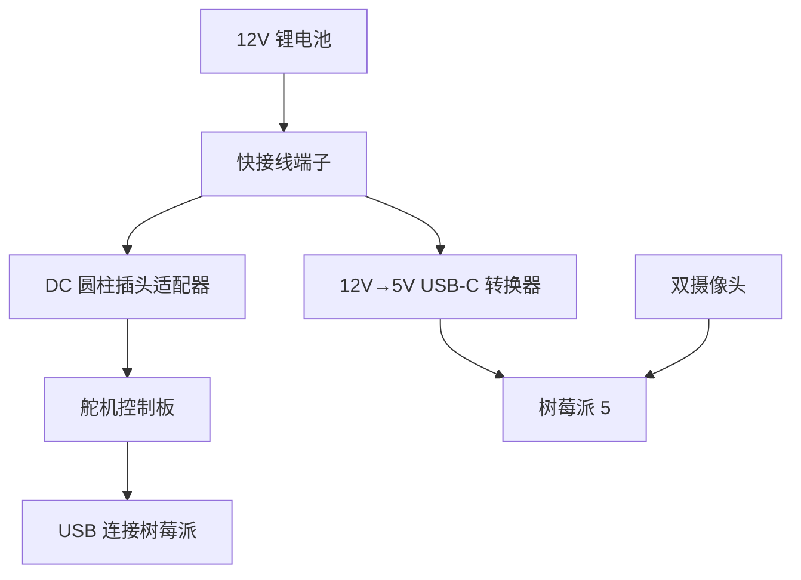

# 组装指南

> **预计时间：约 2 小时**
>
> 精确的组件位置可参考 [Fusion 360 在线 CAD](https://a360.co/4k1P8yO)。
>
> 前提：假设你已构建好 [SO-100/SO-101 手臂](https://github.com/TheRobotStudio/SO-ARM100)。

## 组装概览

## 1. 轮组装配（每台机器人 3 组）

**步骤 1.1**：使用 4 个 **M2×5 自攻螺丝**将驱动电机固定到电机支架上。

**步骤 1.2**：使用 4 个 **M3×12 机器螺丝**将驱动电机支架拧到底板上。

> [!TIP]
> 舵机 ID 排列：**8 为后轮**，**7 和 9 分别为左前轮和右前轮**。

**步骤 1.3**：先拆下轮毂上的 3 个螺丝，使用 2 个 **M4×12 机器螺丝**将轮毂固定到全向轮。

**步骤 1.4**：使用 2 个 **M3×16 机器螺丝**将舵机舵盘固定到轮毂。

**步骤 1.5**：使用 1 个 **M3×6 机器螺丝**将舵机舵盘固定到驱动电机。

## 2. 底板装配

**步骤 2.1**：将 M3 螺母插入舵机控制器支架和电池支架的槽位，使用 4 个 **M3×12 机器螺丝**将两者固定到底板上。

**步骤 2.2**：放入舵机驱动板，将线缆连接到 3 个驱动舵机。

**步骤 2.3**：电路接线

#### 电源端口说明

| 端口 | 用途 |
|------|------|
| **DC 输入** | 直接连接电源 |
| **USB-C (5V)** | 为树莓派提供 5V 电源 |
| **2 针端子 (12V)** | 为 12V 手臂舵机板供电 |

## 3. 顶板装配

1. 将树莓派 5 放入 Pi 外壳底部，盖上外壳顶部
2. 使用 2 个 **M3×12 机器螺丝**将 Pi 固定到顶板上
3. 使用 4 个 **M3×20 机器螺丝**安装 SO-101 手臂

## 4. 最终装配

**步骤 4.1**：将以下线缆穿过顶板中心开口：
- 舵机控制器 USB-C 转 USB-A 线
- 5V USB-C 电源线
- SO-101 舵机线缆

**步骤 4.2**：将舵机驱动板的 USB-C 连接到树莓派的 USB 接口。

**步骤 4.3**：使用 4 个（或 6 个）**M3×12 机器螺丝**将顶板固定到电机支架上。

## 5. 摄像头安装

### 选项 1：Arducam 5MP 广角摄像头

适用于 [Arducam 摄像头](https://www.amazon.com/Arducam-Camera-Computer-Without-Microphone/dp/B0972KK7BC)。打印：
- 1× `base_camera_mount.stl`
- 1× `wrist_camera_mount.stl`

**底座摄像头**：将底座摄像头支架拧到底板底层上，使用 2 个 **M2.5×12 机器螺丝**固定摄像头。

**腕部摄像头**：使用 4 个 **M2×5 自攻螺丝**将腕部摄像头支架拧到静态夹持器上，使用 2 个 **M2.5×12 机器螺丝**固定摄像头。

### 选项 2：USB 网络摄像头

适用于 [USB 网络摄像头](https://www.amazon.fr/Vinmooog-equipement-Microphone-Enregistrement-conférences/dp/B0BG1YJWFN/)。打印：
- 1× `webcam_mount/webcam_mount.stl`
- 1× `webcam_mount/so100_gripper_cam_mount_insert.stl`
- 1× `webcam_mount/webcam_mount_wrist.stl`

## 加电检查

1. 将 DC 圆柱插头适配器插入舵机电机控制器
2. 将 5V USB-C 连接器插入树莓派 5
3. 舵机控制器和摄像头的 USB 线直接插入树莓派

## 下一步

前往 [软件环境安装](/04-software-setup) 配置软件！
