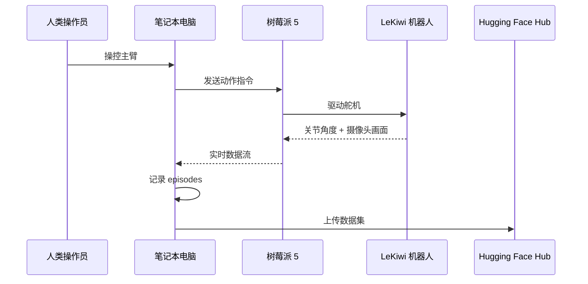

# 数据采集与记录

在熟悉遥控操作后，使用 LeKiwi 录制你的第一个数据集。

## 数据采集流程



## 第 1 步：启动树莓派端

通过 SSH 登录树莓派：

```bash
conda activate lerobot

python lerobot/scripts/control_robot.py \
  --robot.type=lekiwi \
  --control.type=remote_robot
```

## 第 2 步：登录 Hugging Face（可选）

如需上传数据集到 Hugging Face Hub：

```bash
huggingface-cli login --token ${HUGGINGFACE_TOKEN} --add-to-git-credential
```

令牌可以从 [Hugging Face 设置](https://huggingface.co/settings/tokens) 生成。

查看用户名：
```bash
HF_USER=$(huggingface-cli whoami | head -n 1)
echo $HF_USER
```

## 第 3 步：在笔记本电脑上录制

```bash
conda activate lerobot

python lerobot/scripts/control_robot.py \
  --robot.type=lekiwi \
  --control.type=record \
  --control.fps=30 \
  --control.single_task="抓取一个乐高积木并将其放入垃圾桶。" \
  --control.repo_id=${HF_USER}/lekiwi_test \
  --control.tags='["tutorial"]' \
  --control.warmup_time_s=5 \
  --control.episode_time_s=30 \
  --control.reset_time_s=30 \
  --control.num_episodes=2 \
  --control.push_to_hub=true
```

## 录制参数

| 参数 | 说明 | 示例值 |
|------|------|--------|
| `--control.type` | 运行模式 | `record` |
| `--control.fps` | 录制帧率 | `30` |
| `--control.single_task` | 任务描述 | `"抓取积木并放入垃圾桶"` |
| `--control.repo_id` | 数据集仓库名 | `${HF_USER}/lekiwi_test` |
| `--control.tags` | 数据集标签 | `'["tutorial"]'` |
| `--control.warmup_time_s` | 预热时间（秒） | `5` |
| `--control.episode_time_s` | 每回合录制时长（秒） | `30` |
| `--control.reset_time_s` | 回合间重置时间（秒） | `30` |
| `--control.num_episodes` | 回合数 | `2` |
| `--control.push_to_hub` | 是否上传到 Hub | `true` / `false` |

## 继续录制（追加数据）

为同一数据集添加更多回合，添加 `--control.resume=true`：

```bash
python lerobot/scripts/control_robot.py \
  --robot.type=lekiwi \
  --control.type=record \
  --control.fps=30 \
  --control.single_task="抓取积木并放入垃圾桶。" \
  --control.repo_id=${HF_USER}/lekiwi_test \
  --control.num_episodes=5 \
  --control.push_to_hub=true \
  --control.resume=true
```

## 录制技巧

1. **任务描述要具体**：有助于后续筛选和分析
2. **保持操作一致性**：每个回合按相同方式操作
3. **变化场景**：在不同位置放置目标物体，增加数据多样性
4. **每个任务至少 50 个回合**：模仿学习需要足够的数据
5. **重置要彻底**：每个回合结束后将手臂和底盘恢复到相似起始位置

## 有线版本

有线版本所有命令都在**笔记本电脑**上运行。

## 下一步

前往 [可视化与回放](/10-visualization) 查看和检查数据！
