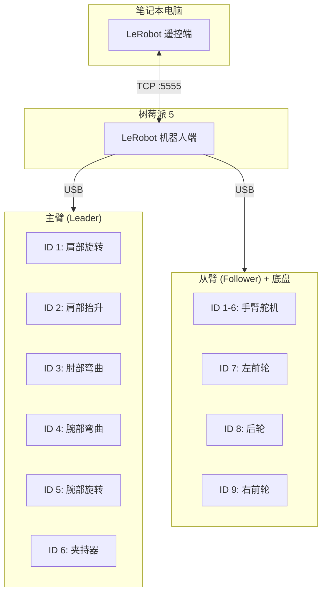
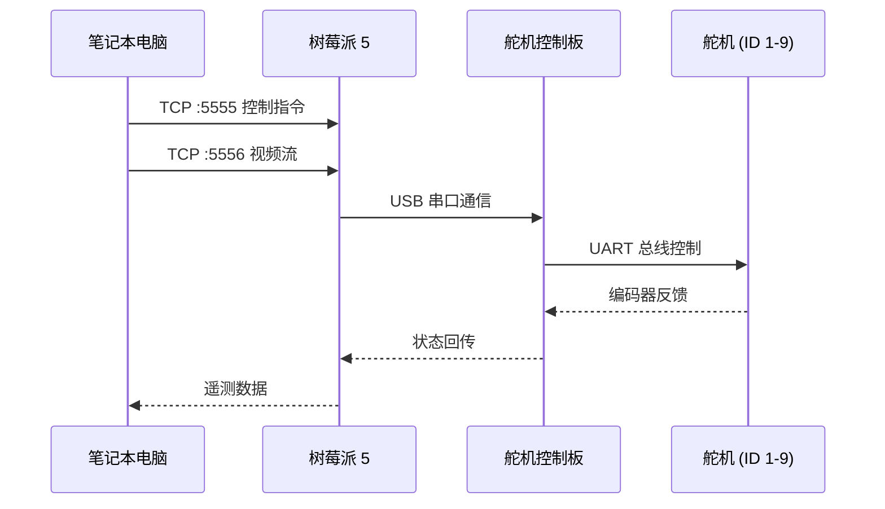

# 电机配置

## 电机连接拓扑



## 查找 USB 端口

运行以下脚本找到各控制板的端口：

```bash
lerobot-find-port
```

**示例输出**：
- `/dev/tty.usbmodem575E0031751`（主臂控制板）
- `/dev/tty.usbmodem575E0032081`（从臂控制板）
- Linux：`/dev/ttyACM0`、`/dev/ttyACM1`

> [!WARNING]
> 在 Linux 上可能需要授予 USB 端口访问权限：
> ```bash
> sudo chmod 666 /dev/ttyACM0
> sudo chmod 666 /dev/ttyACM1
> ```

## 配置电机 ID

依次插入每个电机并运行以下脚本：

```bash
lerobot-setup-motors \
  --robot.type=lekiwi \
  --robot.port=/dev/tty.usbmodem58760431551   # ← 替换为实际端口
```

### 电机 ID 分配

#### 机械臂舵机

| 舵机名称 | ID | 型号 |
|---------|:--:|------|
| shoulder_pan（肩部旋转） | 1 | sts3215 |
| shoulder_lift（肩部抬升） | 2 | sts3215 |
| elbow_flex（肘部弯曲） | 3 | sts3215 |
| wrist_flex（腕部弯曲） | 4 | sts3215 |
| wrist_roll（腕部旋转） | 5 | sts3215 |
| gripper（夹持器） | 6 | sts3215 |

#### 底盘舵机

| 舵机名称 | ID | 位置 |
|---------|:--:|------|
| left_wheel（左前轮） | 7 | 左前方 |
| back_wheel（后轮） | 8 | 后方 |
| right_wheel（右前轮） | 9 | 右前方 |

## 查找树莓派 IP 地址

在树莓派上运行：

```bash
hostname -I
```

记下输出的 IP 地址，后续配置中需要使用。

## 软件通信架构



## 有线版本

有线版本中所有设备连接在同一台笔记本上，IP 地址设为：
```
ip: str = "127.0.0.1"
```

> [!IMPORTANT]
> 确保两台设备上对应的配置文件保持一致！

## 下一步

前往 [校准](/06-calibration) 完成手臂校准！
