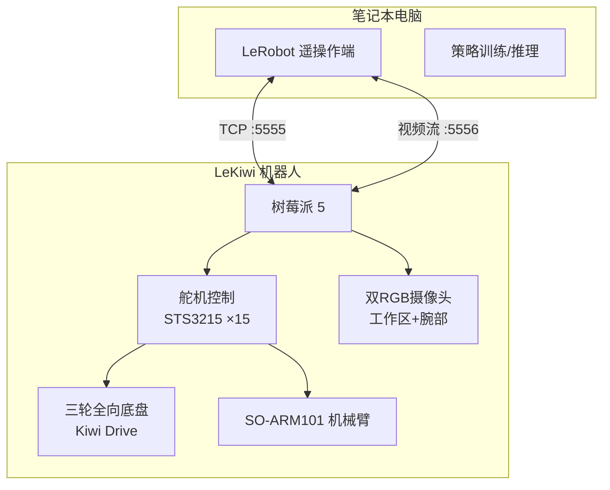
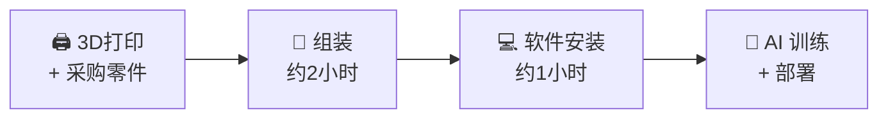

# Lekiwi 底盘概述

Lekiwi 是由 **SIGRobotics @ UIUC** 发起的开源移动机械臂底盘，也是 **Hugging Face LeRobot** 生态中首个完整的移动操作机器人平台。

它将全向移动底盘、机械臂接口、双摄像头视觉系统与树莓派 5 计算平台集于一身。

## 核心特点

| 特点 | 说明 |
|------|------|
| 🔄 **全向移动** | 三轮 Kiwi 驱动，360° 自由移动，STS3215 伺服电机 ×3 |
| 🦾 **机械臂支持** | SO-ARM101 6 轴机械臂，6 自由度灵活操作 |
| 🤖 **AI 原生** | 深度集成 Hugging Face LeRobot，遥操作 → 数据采集 → 训练 → 部署 |
| 🔓 **完全开源** | Apache 2.0 协议，3D 打印文件、软件代码、文档全部公开 |
| 🎮 **直觉式遥操作** | 游戏手柄 + 键盘 WASD + 主臂操控，零门槛上手 |

## 硬件规格

| 组件 | 规格 |
|------|------|
| 尺寸 | 300 × 300 × 230 mm（移动底盘） |
| 重量 | 约 1.7 kg（底盘），整机约 3.5 kg |
| 主控 | Raspberry Pi 5 (4GB+) |
| 驱动 | 三轮 Kiwi 全向驱动 |
| 底盘电机 | STS3215 伺服 ×3（12V，1:345 齿轮比） |
| 机械臂 | SO-ARM101，6 轴，STS3215 ×12 |
| 视觉 | 双 RGB USB 摄像头（工作区 + 腕部） |
| 供电 | 12V 锂电池 / 有线供电 |
| 软件 | LeRobot + ROS 2 Jazzy + PyTorch |
| 协议 | Apache 2.0 |

## 四步上手

