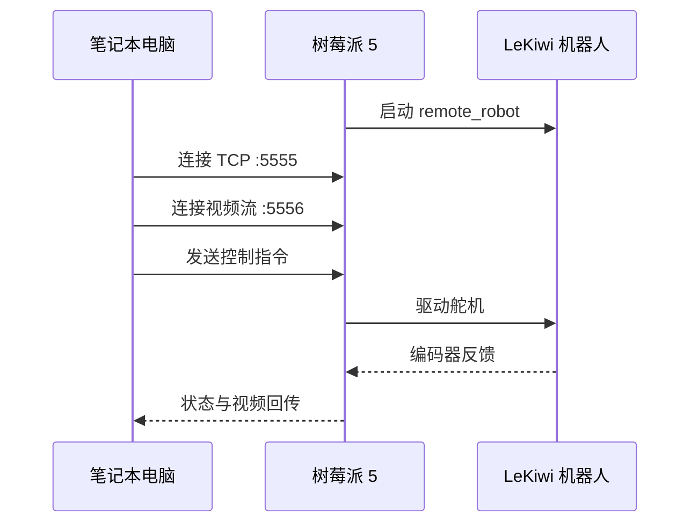

# 遥控操作

> [!TIP]
> **macOS 用户**：前往「系统偏好设置 > 安全性与隐私 > 输入监控」，勾选终端应用以允许键盘输入。

## 启动流程



## 第 1 步：树莓派端（机器人端）

通过 SSH 登录树莓派：

```bash
conda activate lerobot

python lerobot/scripts/control_robot.py \
  --robot.type=lekiwi \
  --control.type=remote_robot
```

## 第 2 步：笔记本电脑端（遥操作端）

```bash
conda activate lerobot

python lerobot/scripts/control_robot.py \
  --robot.type=lekiwi \
  --control.type=teleoperate \
  --control.fps=30
```

连接成功后显示：

```
[INFO] Connected to remote robot at tcp://172.17.133.91:5555
        and video stream at tcp://172.17.133.91:5556
```

## 键盘控制

### 底盘移动

| 按键 | 动作 |
|:----:|------|
| **W** | 前进 |
| **A** | 左移 |
| **S** | 后退 |
| **D** | 右移 |
| **Z** | 左转 |
| **X** | 右转 |

### 模式控制

| 按键 | 动作 |
|:----:|------|
| **R** | 增加速度 |
| **F** | 减少速度 |
| **Q** | 退出遥控 |

### 三种速度模式

| 模式 | 线速度 (m/s) | 旋转速度 (°/s) |
|------|:-----------:|:-------------:|
| 🐢 慢速 | 0.1 | 30 |
| 🐇 中速 | 0.25 | 60 |
| 🚀 快速 | 0.4 | 90 |

## 手臂遥操作

在键盘遥控底盘的同时，**移动主臂**，从臂会自动跟随运动。夹持器也会跟随主臂的开合。

## 通信故障排查

### 验证 IP 地址
在树莓派上运行 `hostname -I`，确认 IP 地址正确。

### Ping 测试
```bash
ping <树莓派IP地址>
```

### SSH 测试
```bash
ssh <用户名>@<树莓派IP地址>
```
如果无法连接，确保 Pi 已启用 SSH：
```bash
sudo raspi-config
# Interfacing Options -> SSH -> 启用
```

> [!IMPORTANT]
> 确保笔记本电脑和树莓派上的配置文件**完全一致**。

## 有线版本

有线版本的两个命令都在**笔记本电脑**上运行，无需 SSH 到树莓派。

## 下一步

前往 [摄像头设置](/08-camera-setup) 配置视觉系统！
