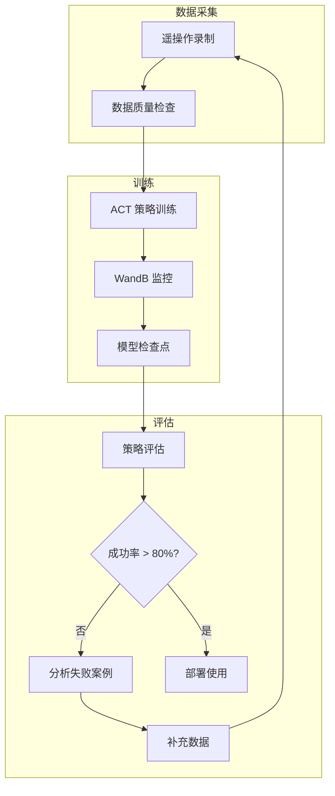

# 训练策略与部署

> 训练需要**带有 GPU 的电脑**。推荐使用 NVIDIA GPU（CUDA），也支持 Apple Silicon（MPS）。

## AI 训练流程



## 训练命令

```bash
python lerobot/scripts/train.py \
  --dataset.repo_id=${HF_USER}/lekiwi_test \
  --policy.type=act \
  --output_dir=outputs/train/act_lekiwi_test \
  --job_name=act_lekiwi_test \
  --policy.device=cuda \
  --wandb.enable=true
```

## 训练参数

| 参数 | 说明 | 可选值 |
|------|------|--------|
| `--dataset.repo_id` | 训练数据集 | Hugging Face 仓库 ID |
| `--policy.type` | 策略类型 | `act`（推荐）、`diffusion` |
| `--output_dir` | 模型输出目录 | 本地路径 |
| `--job_name` | 训练作业名称 | 任意字符串 |
| `--policy.device` | 训练设备 | `cuda`、`mps`、`cpu` |
| `--wandb.enable` | 启用 WandB 可视化 | `true` / `false` |

## 策略类型：ACT

LeKiwi 默认使用 **ACT（Action Chunking Transformer）** 策略：

- 将动作序列分块（chunk）处理
- 使用 Transformer 架构学习动作模式
- 自动适应机器人的电机状态、动作维度和摄像头数量

## Weights & Biases 监控

```bash
wandb login
```

训练时可在 [WandB 网站](https://wandb.ai/) 实时查看训练损失和验证指标。

## 训练时间参考

| GPU | 50 回合数据集 | 
|-----|:---------:|
| NVIDIA RTX 4090 | 2-4 小时 |
| NVIDIA RTX 3080 | 4-6 小时 |
| Apple M2 Pro | 6-10 小时 |

## 训练输出

```
outputs/train/act_lekiwi_test/
├── checkpoints/
│   ├── last/pretrained_model/    ← 最终模型
│   └── epoch_*/...
└── logs/
```

## 评估策略

```bash
python lerobot/scripts/control_robot.py \
  --robot.type=lekiwi \
  --control.type=record \
  --control.fps=30 \
  --control.single_task="驱动到红色方块并拾取它" \
  --control.repo_id=${HF_USER}/eval_act_lekiwi_test \
  --control.num_episodes=10 \
  --control.push_to_hub=true \
  --control.policy.path=outputs/train/act_lekiwi_test/checkpoints/last/pretrained_model
```

## 评估指标

| 指标 | 优秀 | 良好 | 需改进 |
|------|:--:|:--:|:--:|
| **成功率** | `>80%` | `60-80%` | `<60%` |
| **完成时间** | 接近训练数据 | `±20%` | `>±50%` |
| **轨迹平滑度** | 无抖动 | 轻微抖动 | 明显抖动 |

## 部署模式

### 全自主模式

```bash
# 树莓派端
python lerobot/scripts/control_robot.py \
  --robot.type=lekiwi --control.type=remote_robot

# 笔记本端（推理）
python lerobot/scripts/control_robot.py \
  --robot.type=lekiwi --control.type=record \
  --control.policy.path=outputs/train/act_lekiwi_test/checkpoints/last/pretrained_model
```

## 训练技巧

1. **数据越多越好**：建议至少录制 50-100 个高质量回合
2. **监控过拟合**：训练损失很低但实际表现差，可能过拟合
3. **GPU 显存不足**：尝试减小图像分辨率或 batch size
4. **评估不佳**：分析失败视频，针对失败场景补充数据

## 下一步

遇到问题？前往 [故障排查](/12-troubleshooting)！
