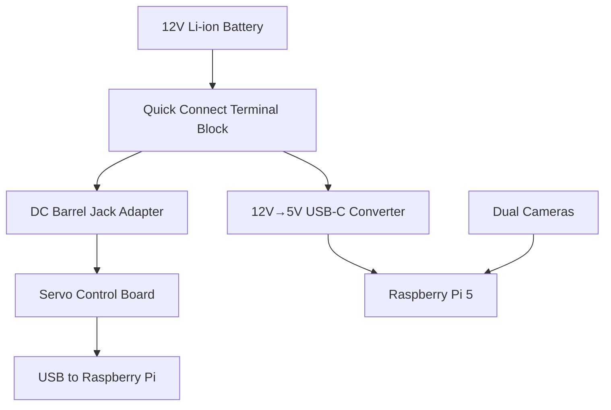

# Assembly Guide

> **Estimated time: ~2 hours**
>
> For precise component positioning, refer to the [Fusion 360 online CAD](https://a360.co/4k1P8yO).
>
> Prerequisite: It is assumed you have already built the [SO-100/SO-101 arms](https://github.com/TheRobotStudio/SO-ARM100).

## Assembly Overview

## 1. Wheel Assembly (x3 per robot)

**Step 1.1**: Secure the drive motor to the motor mount using 4 **M2x5 self-tapping screws**.

**Step 1.2**: Fasten the drive motor mount to the base plate using 4 **M3x12 machine screws**.

> [!TIP]
> Servo ID arrangement: **8 is the rear wheel**, **7 and 9 are the left-front and right-front wheels respectively**.

**Step 1.3**: First remove the 3 screws on the wheel hub, then secure the hub to the omni wheel using 2 **M4x12 machine screws**.

**Step 1.4**: Secure the servo horn to the wheel hub using 2 **M3x16 machine screws**.

**Step 1.5**: Secure the servo horn to the drive motor using 1 **M3x6 machine screw**.

## 2. Base Plate Assembly

**Step 2.1**: Insert M3 nuts into the slots of the servo controller mount and battery mount. Secure both to the base plate using 4 **M3x12 machine screws**.

**Step 2.2**: Place the servo driver board and connect the cables to the 3 drive servos.

**Step 2.3**: Circuit Wiring

#### Power Port Description

| Port | Purpose |
|------|------|
| **DC Input** | Direct power connection |
| **USB-C (5V)** | Provides 5V power to Raspberry Pi |
| **2-Pin Terminal (12V)** | Powers the 12V arm servo board |

## 3. Top Plate Assembly

1. Place the Raspberry Pi 5 into the Pi case bottom and cover with the case top
2. Secure the Pi to the top plate using 2 **M3x12 machine screws**
3. Mount the SO-101 arm using 4 **M3x20 machine screws**

## 4. Final Assembly

**Step 4.1**: Route the following cables through the top plate center opening:
- Servo controller USB-C to USB-A cable
- 5V USB-C power cable
- SO-101 servo cables

**Step 4.2**: Connect the servo driver board's USB-C to the Raspberry Pi's USB port.

**Step 4.3**: Secure the top plate to the motor mounts using 4 (or 6) **M3x12 machine screws**.

## 5. Camera Installation

### Option 1: Arducam 5MP Wide Angle Camera

For the [Arducam camera](https://www.amazon.com/Arducam-Camera-Computer-Without-Microphone/dp/B0972KK7BC). Print:
- 1x `base_camera_mount.stl`
- 1x `wrist_camera_mount.stl`

**Base Camera**: Screw the base camera mount onto the base plate bottom layer and secure the camera using 2 **M2.5x12 machine screws**.

**Wrist Camera**: Screw the wrist camera mount onto the static gripper using 4 **M2x5 self-tapping screws** and secure the camera using 2 **M2.5x12 machine screws**.

### Option 2: USB Webcam

For [USB webcams](https://www.amazon.fr/Vinmooog-equipement-Microphone-Enregistrement-conférences/dp/B0BG1YJWFN/). Print:
- 1x `webcam_mount/webcam_mount.stl`
- 1x `webcam_mount/so100_gripper_cam_mount_insert.stl`
- 1x `webcam_mount/webcam_mount_wrist.stl`

## Power-On Check

1. Plug the DC barrel jack adapter into the servo motor controller
2. Plug the 5V USB-C connector into the Raspberry Pi 5
3. Connect the servo controller and camera USB cables directly to the Raspberry Pi

## Next Steps

Go to [Software Setup](/04-software-setup) to configure the software!
