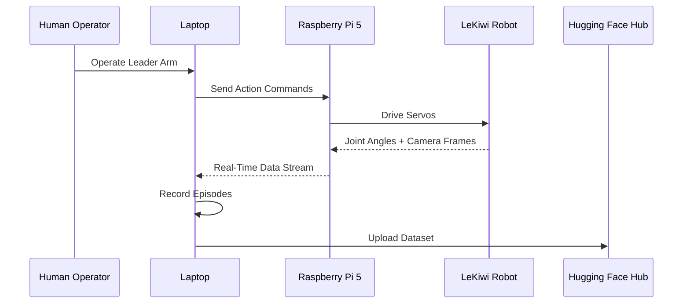

# Data Collection & Recording

Once you are familiar with teleoperation, use LeKiwi to record your first dataset.

## Data Collection Flow



## Step 1: Start Raspberry Pi Server

SSH into the Raspberry Pi:

```bash
conda activate lerobot

python lerobot/scripts/control_robot.py \
  --robot.type=lekiwi \
  --control.type=remote_robot
```

## Step 2: Log In to Hugging Face (Optional)

To upload datasets to the Hugging Face Hub:

```bash
huggingface-cli login --token ${HUGGINGFACE_TOKEN} --add-to-git-credential
```

A token can be generated from [Hugging Face Settings](https://huggingface.co/settings/tokens).

Check your username:
```bash
HF_USER=$(huggingface-cli whoami | head -n 1)
echo $HF_USER
```

## Step 3: Record on Laptop

```bash
conda activate lerobot

python lerobot/scripts/control_robot.py \
  --robot.type=lekiwi \
  --control.type=record \
  --control.fps=30 \
  --control.single_task="Pick up a Lego brick and place it in the trash bin." \
  --control.repo_id=${HF_USER}/lekiwi_test \
  --control.tags='["tutorial"]' \
  --control.warmup_time_s=5 \
  --control.episode_time_s=30 \
  --control.reset_time_s=30 \
  --control.num_episodes=2 \
  --control.push_to_hub=true
```

## Recording Parameters

| Parameter | Description | Example Value |
|------|------|--------|
| `--control.type` | Run mode | `record` |
| `--control.fps` | Recording frame rate | `30` |
| `--control.single_task` | Task description | `"Pick up a brick and place it in the bin"` |
| `--control.repo_id` | Dataset repository name | `${HF_USER}/lekiwi_test` |
| `--control.tags` | Dataset tags | `'["tutorial"]'` |
| `--control.warmup_time_s` | Warm-up time (seconds) | `5` |
| `--control.episode_time_s` | Duration per episode (seconds) | `30` |
| `--control.reset_time_s` | Reset time between episodes (seconds) | `30` |
| `--control.num_episodes` | Number of episodes | `2` |
| `--control.push_to_hub` | Upload to Hub | `true` / `false` |

## Continue Recording (Append Data)

To add more episodes to the same dataset, add `--control.resume=true`:

```bash
python lerobot/scripts/control_robot.py \
  --robot.type=lekiwi \
  --control.type=record \
  --control.fps=30 \
  --control.single_task="Pick up a Lego brick and place it in the trash bin." \
  --control.repo_id=${HF_USER}/lekiwi_test \
  --control.num_episodes=5 \
  --control.push_to_hub=true \
  --control.resume=true
```

## Recording Tips

1. **Be specific with task descriptions**: Helps with subsequent filtering and analysis
2. **Maintain operation consistency**: Operate the same way in each episode
3. **Vary the scene**: Place target objects in different positions to increase data diversity
4. **At least 50 episodes per task**: Imitation learning requires sufficient data
5. **Reset thoroughly**: Return the arm and base to a similar starting position after each episode

## Wired Version

For the wired version, all commands are run on the **laptop**.

## Next Steps

Go to [Visualization & Playback](/10-visualization) to view and inspect your data!
