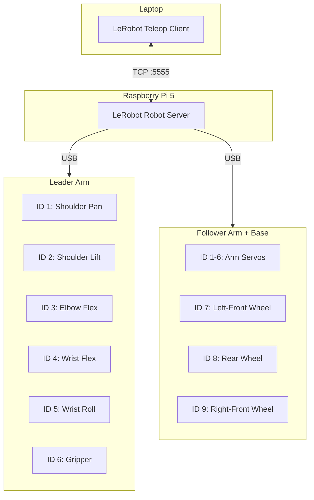
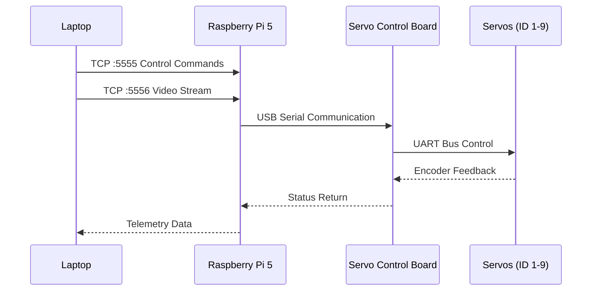

# Motor Configuration

## Motor Connection Topology



## Find USB Ports

Run the following script to find the ports for each control board:

```bash
lerobot-find-port
```

**Example output**:
- `/dev/tty.usbmodem575E0031751` (leader control board)
- `/dev/tty.usbmodem575E0032081` (follower control board)
- Linux: `/dev/ttyACM0`, `/dev/ttyACM1`

> [!WARNING]
> On Linux, you may need to grant USB port access permissions:
> ```bash
> sudo chmod 666 /dev/ttyACM0
> sudo chmod 666 /dev/ttyACM1
> ```

## Configure Motor IDs

Plug in each motor one at a time and run the following script:

```bash
lerobot-setup-motors \
  --robot.type=lekiwi \
  --robot.port=/dev/tty.usbmodem58760431551   # ← Replace with actual port
```

### Motor ID Assignment

#### Arm Servos

| Servo Name | ID | Model |
|---------|:--:|------|
| shoulder_pan | 1 | sts3215 |
| shoulder_lift | 2 | sts3215 |
| elbow_flex | 3 | sts3215 |
| wrist_flex | 4 | sts3215 |
| wrist_roll | 5 | sts3215 |
| gripper | 6 | sts3215 |

#### Base Servos

| Servo Name | ID | Position |
|---------|:--:|------|
| left_wheel | 7 | Left-front |
| back_wheel | 8 | Rear |
| right_wheel | 9 | Right-front |

## Find Raspberry Pi IP Address

Run on the Raspberry Pi:

```bash
hostname -I
```

Note the IP address displayed — you will need it for subsequent configuration.

## Software Communication Architecture



## Wired Version

In the wired version, all devices are connected to the same laptop. Set the IP address to:
```
ip: str = "127.0.0.1"
```

> [!IMPORTANT]
> Ensure that the configuration files on both devices are kept consistent!

## Next Steps

Go to [Calibration](/06-calibration) to complete arm calibration!
