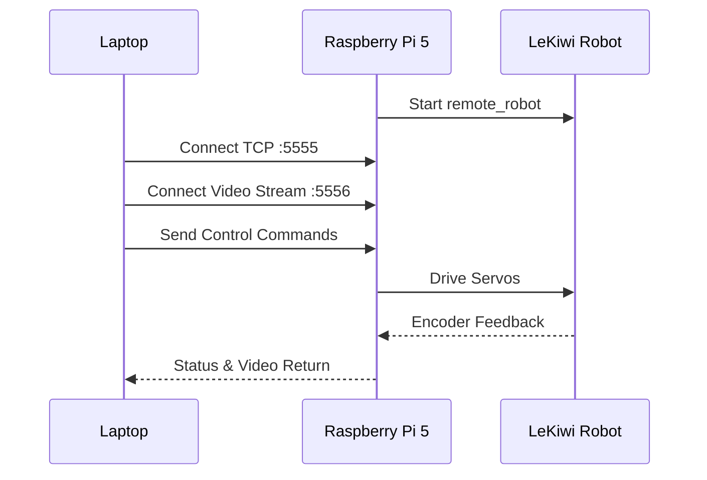

# Teleoperation

> [!TIP]
> **macOS users**: Go to "System Preferences > Security & Privacy > Input Monitoring" and enable your terminal application to allow keyboard input.

## Startup Process



## Step 1: Raspberry Pi Side (Robot Server)

SSH into the Raspberry Pi:

```bash
conda activate lerobot

python lerobot/scripts/control_robot.py \
  --robot.type=lekiwi \
  --control.type=remote_robot
```

## Step 2: Laptop Side (Teleoperation Client)

```bash
conda activate lerobot

python lerobot/scripts/control_robot.py \
  --robot.type=lekiwi \
  --control.type=teleoperate \
  --control.fps=30
```

Once connected, the following is displayed:

```
[INFO] Connected to remote robot at tcp://172.17.133.91:5555
        and video stream at tcp://172.17.133.91:5556
```

## Keyboard Control

### Base Movement

| Key | Action |
|:----:|------|
| **W** | Move Forward |
| **A** | Move Left |
| **S** | Move Backward |
| **D** | Move Right |
| **Z** | Rotate Left |
| **X** | Rotate Right |

### Mode Control

| Key | Action |
|:----:|------|
| **R** | Increase Speed |
| **F** | Decrease Speed |
| **Q** | Quit Teleoperation |

### Three Speed Modes

| Mode | Linear Speed (m/s) | Rotation Speed (°/s) |
|------|:-----------:|:-------------:|
| 🐢 Slow | 0.1 | 30 |
| 🐇 Medium | 0.25 | 60 |
| 🚀 Fast | 0.4 | 90 |

## Arm Teleoperation

While controlling the base via keyboard, **move the leader arm** and the follower arm will automatically track the motion. The gripper will also follow the opening and closing of the leader.

## Communication Troubleshooting

### Verify IP Address
Run `hostname -I` on the Raspberry Pi to confirm the correct IP address.

### Ping Test
```bash
ping <Raspberry Pi IP address>
```

### SSH Test
```bash
ssh <username>@<Raspberry Pi IP address>
```
If the connection fails, ensure SSH is enabled on the Pi:
```bash
sudo raspi-config
# Interfacing Options -> SSH -> Enable
```

> [!IMPORTANT]
> Ensure that the configuration files on the laptop and Raspberry Pi are **exactly the same**.

## Wired Version

For the wired version, both commands are run on the **laptop** — no need to SSH into a Raspberry Pi.

## Next Steps

Go to [Camera Setup](/08-camera-setup) to configure the vision system!
