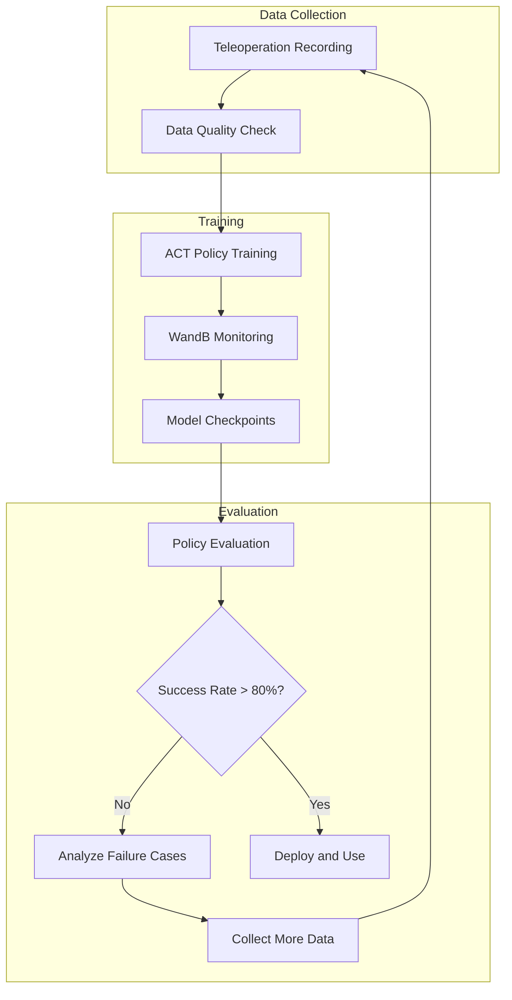

# Training Strategy & Deployment

> Training requires a **computer with a GPU**. An NVIDIA GPU (CUDA) is recommended, and Apple Silicon (MPS) is also supported.

## AI Training Pipeline



## Training Command

```bash
python lerobot/scripts/train.py \
  --dataset.repo_id=${HF_USER}/lekiwi_test \
  --policy.type=act \
  --output_dir=outputs/train/act_lekiwi_test \
  --job_name=act_lekiwi_test \
  --policy.device=cuda \
  --wandb.enable=true
```

## Training Parameters

| Parameter | Description | Options |
|------|------|--------|
| `--dataset.repo_id` | Training dataset | Hugging Face repository ID |
| `--policy.type` | Policy type | `act` (recommended), `diffusion` |
| `--output_dir` | Model output directory | Local path |
| `--job_name` | Training job name | Arbitrary string |
| `--policy.device` | Training device | `cuda`, `mps`, `cpu` |
| `--wandb.enable` | Enable WandB visualization | `true` / `false` |

## Policy Type: ACT

LeKiwi uses the **ACT (Action Chunking Transformer)** policy by default:

- Processes action sequences in chunks
- Uses a Transformer architecture to learn action patterns
- Automatically adapts to the robot's motor state, action dimensions, and number of cameras

## Weights & Biases Monitoring

```bash
wandb login
```

During training, you can view training loss and validation metrics in real time on the [WandB website](https://wandb.ai/).

## Training Time Reference

| GPU | 50-Episode Dataset |
|-----|:---------:|
| NVIDIA RTX 4090 | 2-4 hours |
| NVIDIA RTX 3080 | 4-6 hours |
| Apple M2 Pro | 6-10 hours |

## Training Output

```
outputs/train/act_lekiwi_test/
├── checkpoints/
│   ├── last/pretrained_model/    ← Final model
│   └── epoch_*/...
└── logs/
```

## Evaluating the Policy

```bash
python lerobot/scripts/control_robot.py \
  --robot.type=lekiwi \
  --control.type=record \
  --control.fps=30 \
  --control.single_task="Drive to the red cube and pick it up" \
  --control.repo_id=${HF_USER}/eval_act_lekiwi_test \
  --control.num_episodes=10 \
  --control.push_to_hub=true \
  --control.policy.path=outputs/train/act_lekiwi_test/checkpoints/last/pretrained_model
```

## Evaluation Metrics

| Metric | Excellent | Good | Needs Improvement |
|------|:--:|:--:|:--:|
| **Success Rate** | `>80%` | `60-80%` | `<60%` |
| **Completion Time** | Close to training data | `±20%` | `>±50%` |
| **Trajectory Smoothness** | No jitter | Slight jitter | Noticeable jitter |

## Deployment Mode

### Fully Autonomous Mode

```bash
# Raspberry Pi side
python lerobot/scripts/control_robot.py \
  --robot.type=lekiwi --control.type=remote_robot

# Laptop side (inference)
python lerobot/scripts/control_robot.py \
  --robot.type=lekiwi --control.type=record \
  --control.policy.path=outputs/train/act_lekiwi_test/checkpoints/last/pretrained_model
```

## Training Tips

1. **More data is better**: Aim to record at least 50-100 high-quality episodes
2. **Monitor for overfitting**: Low training loss but poor real-world performance may indicate overfitting
3. **GPU out of memory**: Try reducing image resolution or batch size
4. **Poor evaluation results**: Analyze failure videos and collect additional data targeting failure scenarios

## Next Steps

Running into issues? Go to [Troubleshooting](/12-troubleshooting)!
